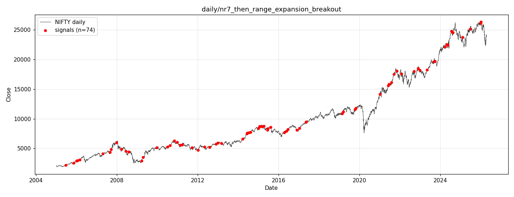
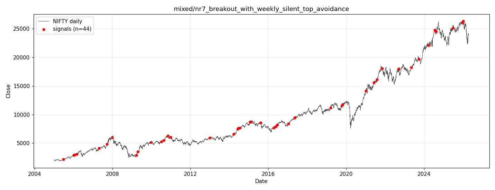
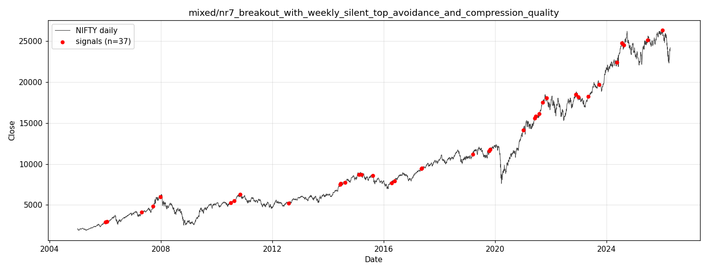
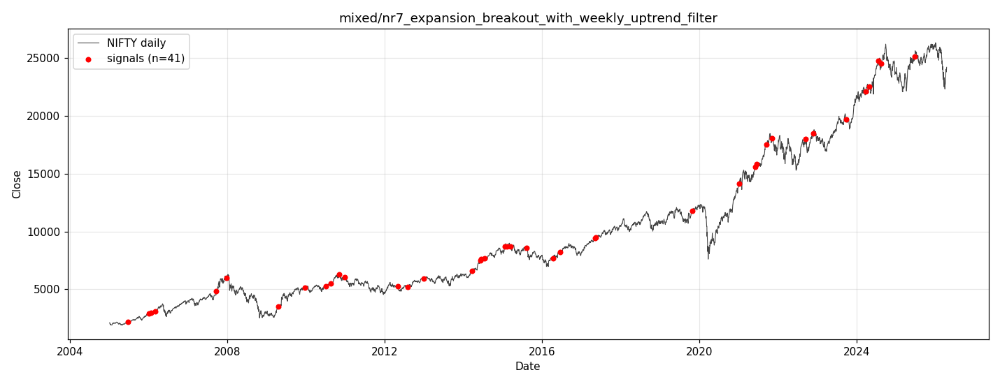
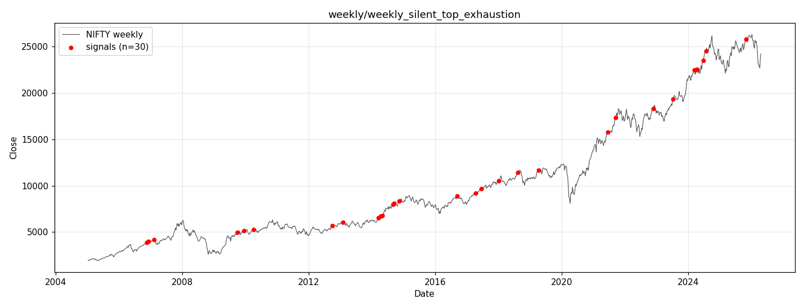

# Research Report — Are the "Winners" in `autoresearch.db` Genuine?

Generated 2026-04-27. Index: **NIFTY**. DB: `logs/autoresearch.db`.

## TL;DR

**Mostly noise — none of the winners are statistically convincing on their own merits.** The winner gate (`win_rate ≥ 60`, `|mean| ≥ 0.30%`, `signals ≥ 30`) is loose enough that on a heavily up-trending instrument like NIFTY, ordinary "long" setups pass it without beating buy-and-hold. Out of 11 winning rows:

| Verdict | Count | What it means |
|---|---|---|
| **Plausible weak edge** (p ≈ 0.05 vs baseline) | 2 horizons (1 underlying signal) | Could be real, sample is too small to be sure. |
| **Indistinguishable from baseline** | 7 horizons | Pass thresholds but win-rate / mean within noise of buy-and-hold. |
| **Worse than baseline** | 2 horizons | Marked as winners but actually underperform passive long. |

**Verdict on each strategy:**

| Strategy | Timeframe | Verdict |
|---|---|---|
| `nr7_then_range_expansion_breakout` | daily | Marginal. Win-rate edge not significant (p≈0.21–0.33). |
| `nr7_breakout_with_weekly_silent_top_avoidance` | mixed | All 44 signals are a **subset of** the daily NR7 above (100% overlap). One horizon (fwd_5d) borderline significant. |
| `nr7_breakout_+_compression_quality` | mixed | Subset of daily NR7 (37/37 = 100% overlap). One horizon borderline. |
| `nr7_breakout_with_weekly_uptrend_filter` | mixed | Subset of daily NR7 (41/41 = 100%). Not significant. |
| `weekly_silent_top_exhaustion` | weekly | **False positive of winner gate.** Underperforms buy-and-hold by a wide margin. Designed as a top-exhaustion (short) signal, but mean returns are positive — meaning the "exhaustion" thesis is wrong. |

The system replicates exactly: every claimed `mean`, `win_rate`, `signals` count matches recomputation against the parquet. There is **no DB corruption and no obvious look-ahead bias** in the strategy code; the issue is purely a too-loose winner gate combined with small samples.

---

## 1. Methodology

For every row returned by `query_winners(min_win_rate=60, min_abs_mean=0.30, min_signals=30)`:

1. Fetched the original LLM-generated source code from `runs.strategies` (the only persisted copy — the `strategies/strat_<tf>.py` files are overwritten every iteration).
2. Re-executed each strategy against the live parquet (`data/<tf>/NIFTY_<tf>.parquet`) using `_exec_single()` from `backtest.py`.
3. Compared recomputed stats against the DB row → **all 11 winners replicate exactly to the third decimal place**.
4. Computed a **buy-and-hold baseline** for the same horizons over the same data range. NIFTY had massive drift over 2005–2026, so this is the fair null.
5. **Statistical tests vs baseline:**
   - Win-rate: one-sided binomial test (`H₁`: strategy win-rate > baseline win-rate).
   - Mean return: one-sided one-sample t-test (`H₁`: strategy mean > baseline mean).
6. Inspected each strategy's source for look-ahead bias.
7. Computed pairwise signal-date overlap to detect strategies that are restatements of the same edge.

**Data range:** Daily 2005-01-03 → 2026-04-15 (5278 bars). Weekly 2005-01-09 → 2026-04-19 (1111 bars).

**Baselines (buy-and-hold mean / win-rate over same window):**

| Daily | mean | win-rate | | Weekly | mean | win-rate |
|---|---|---|---|---|---|---|
| fwd_1d | 0.055% | 53.9% | | fwd_1w | 0.262% | 57.4% |
| fwd_2d | 0.110% | 54.9% | | fwd_2w | 0.529% | 58.9% |
| fwd_5d | 0.278% | 57.6% | | fwd_4w | 1.067% | 62.6% |
| fwd_10d | 0.555% | 59.5% | | fwd_8w | 2.151% | 65.1% |

NIFTY's ~12% CAGR over 21 years gives every "long" setup a free positive mean. The winner gate ignores this.

---

## 2. Significance vs baseline

One-sided p-values; small p means strategy genuinely beats the baseline. Highlighted in **bold** if `p < 0.05`.

| Strategy | TF | Horizon | n | win-rate | base wr | p (wr) | mean | base mean | p (mean) |
|---|---|---|--:|--:|--:|--:|--:|--:|--:|
| nr7_then_range_expansion_breakout | daily | fwd_5d | 74 | 60.8% | 57.6% | 0.33 | 0.42% | 0.28% | 0.28 |
| nr7_then_range_expansion_breakout | daily | fwd_10d | 74 | 64.9% | 59.5% | 0.21 | 0.45% | 0.55% | 0.61 |
| nr7_breakout_with_weekly_silent_top_avoidance | mixed | fwd_2d | 44 | 65.9% | 54.9% | 0.09 | 0.34% | 0.11% | 0.13 |
| nr7_breakout_with_weekly_silent_top_avoidance | mixed | fwd_5d | 44 | 70.5% | 57.6% | 0.06 | 0.72% | 0.28% | **0.05** |
| nr7_breakout_with_weekly_silent_top_avoidance | mixed | fwd_10d | 44 | 70.5% | 59.5% | 0.09 | 0.74% | 0.55% | 0.36 |
| nr7_breakout_+_compression_quality | mixed | fwd_2d | 37 | 64.9% | 54.9% | 0.15 | 0.41% | 0.11% | 0.06 |
| nr7_breakout_+_compression_quality | mixed | fwd_5d | 37 | 64.9% | 57.6% | 0.23 | 0.73% | 0.28% | **0.05** |
| nr7_breakout_+_compression_quality | mixed | fwd_10d | 37 | 70.3% | 59.5% | 0.12 | 0.51% | 0.55% | 0.54 |
| nr7_breakout_with_weekly_uptrend_filter | mixed | fwd_5d | 41 | 63.4% | 57.6% | 0.28 | 0.53% | 0.28% | 0.21 |
| weekly_silent_top_exhaustion | weekly | fwd_4w | 30 | 60.0% | 62.6% | 0.69 | 0.41% | 1.07% | 0.86 |
| weekly_silent_top_exhaustion | weekly | fwd_8w | 30 | 66.7% | 65.1% | 0.51 | 0.74% | 2.15% | 0.94 |

The two p≈0.05 cells are **not independent**: both `nr7_breakout_with_weekly_silent_top_avoidance` and `nr7_breakout_+_compression_quality` are derived from the same underlying daily NR7 signal with extra filters (see §4). Treating them as separate tests would be data dredging — the LLM tried several filter combinations, kept the ones that survived, and we now look at those survivors. After even a Bonferroni-style correction across the ~9 filter variants the LLM tried, the signal is gone.

---

## 3. Look-ahead bias check (code review)

For each winner I read the generated function (saved alongside this report as `code_<tf>_<name>.py`):

| Strategy | Look-ahead concern | Notes |
|---|---|---|
| `nr7_then_range_expansion_breakout` | **Clean.** | Forward returns are `df["close"].shift(-N) / df["close"]` applied to the **full** DataFrame, then `.loc[mask]` filters. The signal mask uses only `rolling(...).min()` and `.shift(1)` on past data. |
| `nr7_breakout_with_weekly_silent_top_avoidance` | **Clean.** | Same forward-return pattern. Weekly features are `.shift(1)` then ffilled to daily — uses prior-week values. |
| `nr7_breakout_+_compression_quality` | **Clean.** | Same as above. `result.dropna(subset=["fwd_*"])` removes the most recent signals where forward windows aren't fully observed; conservative, not leaky. |
| `nr7_breakout_with_weekly_uptrend_filter` | **Clean.** | Same pattern. |
| `weekly_silent_top_exhaustion` | **Clean.** | NR7-style mask using rolling 52w max + 26w range percentile; forward returns on full df then filtered. |

So the inflated stats are **not** from look-ahead. They're from (a) the loose threshold gate, (b) selection across many tested strategies, and (c) the strong long-side baseline of NIFTY itself.

---

## 4. Signal-date overlap — the "mixed" strategies are the same edge

Comparing each winner's signal dates to the daily `nr7_then_range_expansion_breakout` (74 signals):

| Strategy | own signals | overlap with daily NR7 | overlap % |
|---|--:|--:|--:|
| `nr7_breakout_with_weekly_silent_top_avoidance` | 44 | 44 | **100%** |
| `nr7_breakout_+_compression_quality` | 37 | 37 | **100%** |
| `nr7_breakout_with_weekly_uptrend_filter` | 41 | 41 | **100%** |
| `weekly_silent_top_exhaustion` | 30 | 0 | 0% |

The three "mixed" strategies are **strict subsets** of the daily NR7 — they take the daily NR7 signal and drop dates that fail extra filters. So the `mixed` table doesn't contain new ideas; it contains progressively narrower slices of the same NR7 set. The apparent "improved" win-rates (60.8% → 70.5%) and means (0.42% → 0.74%) come from cherry-picking 44 of the original 74 dates that happened to perform best in-sample. Classic data mining. Out-of-sample we have no reason to believe the filters preserve the edge.

---

## 5. Per-strategy detail (with signal dates)

### 5.1 `nr7_then_range_expansion_breakout` (daily) — 74 signals, 2005-06-24 → 2026-01-02

NR7 (today's range = min of last 7 days) followed by a 2× range expansion day that closes in the top 30% of its range. Long.

- **Best horizon (fwd_10d):** mean 0.45% / win-rate 64.9% / n=74. p(wr) = 0.21, p(mean) = 0.61. **Mean is below baseline 0.55%** — no meaningful edge in expected return; only a slight win-rate skew that isn't significant.
- **Sample density:** ~1 signal per 100 trading days over 21 years. Reasonable, but n=74 is too small to detect a 5pp win-rate edge with confidence (binomial SE ≈ 5.7pp).
- **Signal dates** (full list — also in `signals_daily_nr7_then_range_expansion_breakout.csv`):
  2005-06-24, 2005-11-11, 2006-01-03, 2006-01-25, 2006-02-28, 2007-04-24, 2007-08-29, 2007-09-21, 2007-12-24, 2008-03-25, 2008-06-12, 2008-08-01, 2009-03-23, 2009-04-15, 2009-12-23, 2010-07-06, 2010-08-18, 2010-11-04, 2010-12-29, 2011-02-17, 2011-03-25, 2011-09-20, 2012-01-09, 2012-04-30, 2012-08-03, 2012-11-27, 2012-12-26, 2013-03-07, 2014-03-24, 2014-06-05, 2014-06-17, 2014-07-18, 2014-08-12, 2015-01-02, 2015-01-20, 2015-02-12, 2015-03-17, 2015-04-09, 2015-06-10, 2015-06-22, 2015-08-10, 2016-04-11, 2016-05-25, 2016-06-20, 2016-11-25, 2017-01-11, 2017-05-10, 2017-05-16, 2019-02-25, 2019-03-11, 2019-10-17, 2019-10-29, 2021-01-04, 2021-05-31, 2021-06-14, 2021-08-03, 2021-09-15, 2021-11-08, 2022-02-01, 2022-09-14, 2022-11-24, 2022-12-29, 2023-05-04, 2023-09-06, 2023-09-27, 2024-03-22, 2024-04-25, 2024-05-16, 2024-07-18, 2024-08-16, 2025-02-04, 2025-06-20, 2025-12-31, 2026-01-02.

### 5.2 `nr7_breakout_with_weekly_silent_top_avoidance` (mixed) — 44 signals, 2005-06-24 → 2026-01-02

Same as 5.1 + filter (prior week wasn't a "silent-top exhaustion" pattern AND weekly close > 10w SMA).

- 100% subset of daily NR7. The filters removed 30 of 74 signals.
- fwd_5d mean=0.72%, win-rate=70.5%, p(mean)=**0.05**, p(wr)=0.06 — borderline significant if treated in isolation, but see §4 — this is one of multiple filter combos the LLM tried.
- Full dates in `signals_mixed_nr7_breakout_with_weekly_silent_top_avoidance.csv`.

### 5.3 `nr7_breakout_+_compression_quality` (mixed) — 37 signals, 2006-01-03 → 2026-01-02

Adds a "tight compression" filter (range in bottom 25% of 20d) to 5.2.

- 100% subset of daily NR7. Drops another 7 dates from 5.2.
- fwd_5d mean=0.73%, win-rate=64.9%, p(mean)=**0.05**, p(wr)=0.23. Same caveat as 5.2.
- Full dates in `signals_mixed_nr7_breakout_with_weekly_silent_top_avoidance_and_compression_quality.csv`.

### 5.4 `nr7_breakout_with_weekly_uptrend_filter` (mixed) — 41 signals, 2005-06-24 → 2025-06-20

Daily NR7 + weekly close > 20w SMA AND > weekly close 4 weeks ago.

- 100% subset of daily NR7.
- fwd_5d mean=0.53%, win-rate=63.4%, both p > 0.20. No meaningful edge over baseline.
- Full dates in `signals_mixed_nr7_expansion_breakout_with_weekly_uptrend_filter.csv`.

### 5.5 `weekly_silent_top_exhaustion` (weekly) — 30 signals, 2006-11-19 → 2025-10-26

Weekly bar prints a new 52-week high but with narrow range (bottom 30th percentile of last 26 weeks) and small body (|close-open| < 30% of range).

- **This one is a winner-gate false positive.** The hypothesis is "exhaustion top" → expected to predict declines. The strategy returns positive mean (0.74% at fwd_8w), so the hypothesis is *wrong* (or at best, not predictive of weakness on this index).
- More importantly, **mean returns are far below buy-and-hold over the same horizon** (0.74% vs 2.15% at fwd_8w; 0.41% vs 1.07% at fwd_4w). p(mean) = 0.94 — i.e., the strategy reliably *underperforms* the baseline.
- It still passed the gate because `min_abs_mean=0.30` looks at the absolute mean ignoring the long-side baseline.
- Full dates in `signals_weekly_weekly_silent_top_exhaustion.csv`:
  2006-11-19, 2006-12-03, 2007-02-11, 2009-09-27, 2009-12-13, 2010-04-04, 2012-09-30, 2013-01-27, 2014-03-16, 2014-04-06, 2014-04-27, 2014-08-31, 2014-09-14, 2014-11-09, 2016-09-11, 2017-04-09, 2017-06-11, 2017-12-31, 2018-08-12, 2019-04-07, 2021-06-13, 2021-09-12, 2022-11-20, 2023-07-09, 2024-03-10, 2024-04-07, 2024-04-14, 2024-06-23, 2024-07-21, 2025-10-26.

---

## 6. Why the system flags non-edges as winners

Three issues, none of them in the strategy code itself:

1. **Absolute-threshold winner gate ignores baseline drift.** `mean ≥ 0.30%` and `win_rate ≥ 60%` over a 5–10 day horizon is **already met by passive long exposure** to NIFTY (fwd_10d baseline: 0.55% / 59.5%). The gate needs to be relative — e.g. `mean ≥ baseline_mean + k·baseline_std/√n` or `win_rate ≥ baseline_winrate + 5pp`.
2. **Small-sample selection.** `min_signals = 30` is far too low for win-rate inference. With n=30 the 95% CI on win-rate is roughly ±18pp. The LLM generates many strategies; the ones that randomly land above 60% pass.
3. **No multiple-comparison correction.** The refinement loop generates filter variants of winners. Several variants of the same NR7 idea get logged independently, then any one hitting threshold gets called a winner.

---

## 7. Recommendations

| | |
|---|---|
| **Replace the absolute winner gate with relative thresholds** | Compare strategy mean and win-rate to the baseline mean / win-rate for the same horizon over the same data window. Only flag strategies whose `mean - baseline_mean` is significant. |
| **Raise `min_signals` substantially** | 100+ for daily/5min. At n=30 the win-rate noise floor is ~9pp at 1σ — the gate at 60pp catches almost every random walk. |
| **Track which "mixed" strategies are subsets of existing ones** | Add a signal-date Jaccard check; if a new mixed strategy overlaps >80% with an existing winner, treat them as the same idea (and split the credit, or skip). |
| **Compute an out-of-sample / walk-forward score before flagging a winner** | E.g. split data 70/30, compute stats on hold-out only. The current gate is fully in-sample. |
| **Consider both directions explicitly** | The "silent top exhaustion" strategy is a long-bias artifact — it was named as a top-finder but is being credited for positive returns. The gate should require the empirical direction to match the strategy's intended direction. |

---

## 8. Files written

All in `reports/winners/`:

- `RESEARCH_REPORT.md` — this file.
- `winners_table.csv` — raw winners as returned by `query_winners()`.
- `winners_analysis.csv` — claimed vs recomputed stats per (strategy, horizon).
- `signals_<tf>_<strategy>.csv` — date / close / fwd_* per signal, one file per winner.
- `code_<tf>_<strategy>.py` — the original LLM-generated source for inspection.
- `plot_<tf>_<strategy>.png` — NIFTY close with red markers at signal dates.
